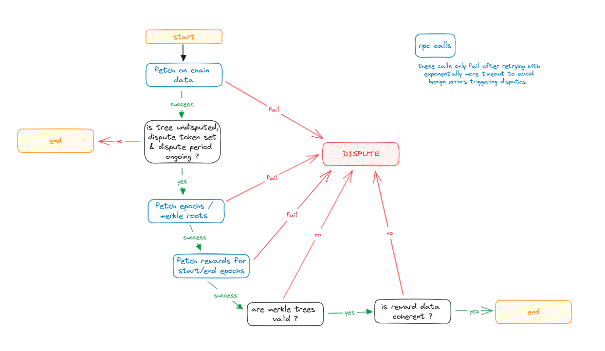
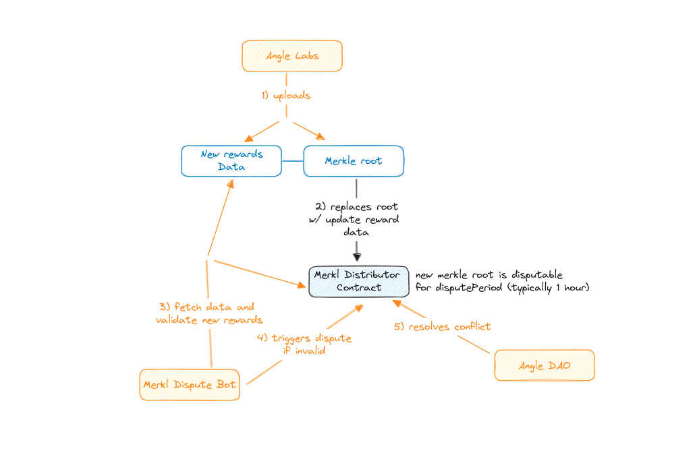

# Merkl Dispute bot

## How does it work?

The bot runs when a dispute period is ongoing and checks if the merkle root submitted on chain is correct.
If the data is incorrect or it is unable to fetch enough data to be able to make the checks, it will send a dispute.



## What is a dispute ?

A dispute is a halt of the merkl root update on the contract, which allows the DAO to come in and resolve the conflict. 
This mechanism can prevent a malicious or accidental update of the new reward data which might be invalid.



## Pre-requisites

You must provide some neccesary envionrment variables:
```env
PORT: 5002
ENV: 'prod'

CHAINID= 1
KEEPER_GITHUB_AUTH_TOKEN= ""
DISPUTE_BOT_PRIVATE_KEY= ""
DISCORD_TOKEN= ""
PROVIDER_137= ""
PROVIDER_10= ""
PROVIDER_1= ""
PROVIDER_42161= ""
PROVIDER_1101= ""
```

## Run the bot

Install the dependencies

```bash
yarn install
```

Build and run the bot

```bash
yarn build
yarn start
```