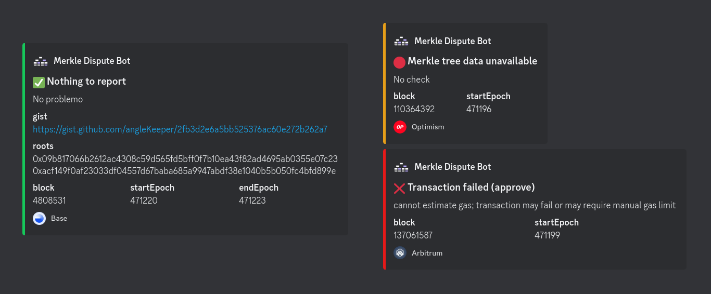

# Merkl Dispute bot

## How does it work?

The bot runs when a dispute period is ongoing and checks if the merkle root submitted on chain is correct.
If the data is incorrect or it is unable to fetch enough data to be able to make the checks, it will send a dispute.


## What is a dispute ?

A dispute is a halt of the merkl root update on the contract, which allows the DAO to come in and resolve the conflict.
This mechanism can prevent a malicious or accidental update of the new reward data which might be invalid.


## Pre-requisites

You must provide some necessary environment variables (see [.env.example](./.env.example)):

```env
PORT= 5002
ENV= 'prod'

CHAINID= 1
DISPUTE_BOT_PRIVATE_KEY= ""
PROVIDER_137= ""
PROVIDER_10= ""
PROVIDER_1= ""
PROVIDER_42161= ""
PROVIDER_1101= ""
```

## Run the bot

Install the dependencies and build the bot:

```bash
yarn install
yarn build
```

```bash
yarn bot diff --chain 1 --from 1695734659 --to 1695821059 --gist
```

### Every n seconds

Run the bot periodically (recommended interval is 1 hour):

```bash
yarn bot watch --chain <chainId> --time <timeIntervalInSeconds>
```

### As a one-time check

You can also run the bot once to try to dispute the latest block or check the bot against a previous block:

```bash
yarn bot:hot run -c 81457
```

### Compare two points in time

You can compare two points in time and generate a diff table, using `--gist` requires `KEEPER_GITHUB_AUTH_TOKEN` env variable.

```bash
yarn bot diff --chain <chainId> --from <timestamp1> --to <timestamp1>
yarn bot diff --chain <chainId> --from <timestamp1> --to <timestamp1> --gist
```

### As a server

Run the bot as an Express server to call a dispute check from an HTTP request:

```bash
yarn bot serve
```

`chain` and `blockNumber` parameters are optional, if not provided, the chain will be set from the environement variable `CHAINID`, the blockNumber as the latest one.

```http
GET http://localhost:5002/
GET http://localhost:5002/<chainId>/
GET http://localhost:5002/<chainId>/<blockNumber>
```

## Optional logging tools

The bot supports Discord logging and gist creation for the diff tables, enable those features by providing env variables `DISCORD_TOKEN`, `DISCORD_LOG_CHANNEL`, `DISCORD_ALERT_CHANNEL` and `KEEPER_GITHUB_AUTH_TOKEN` respectively.


